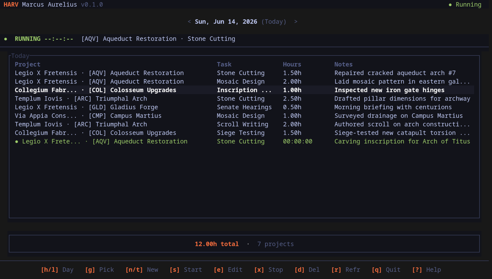
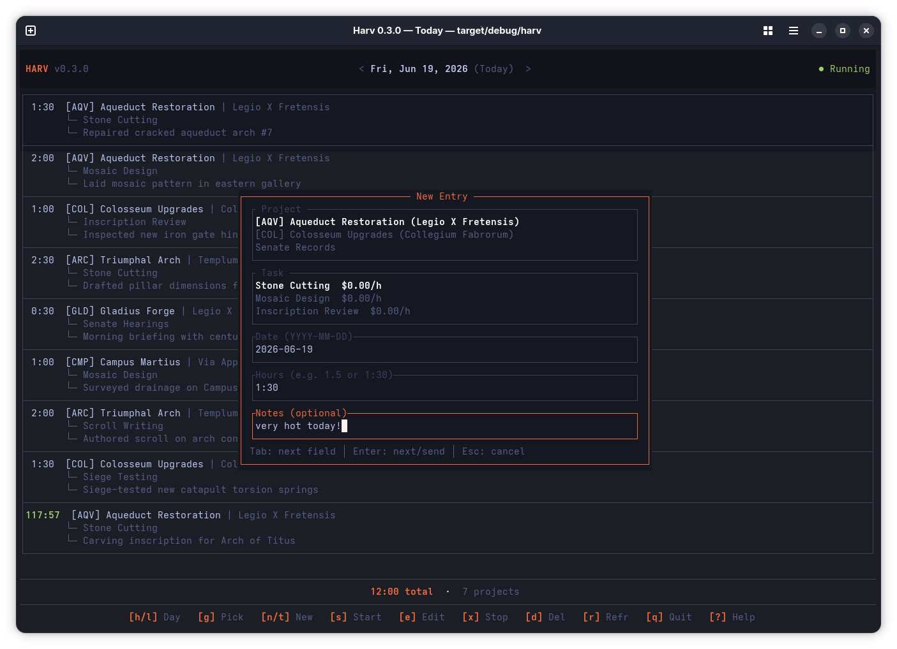
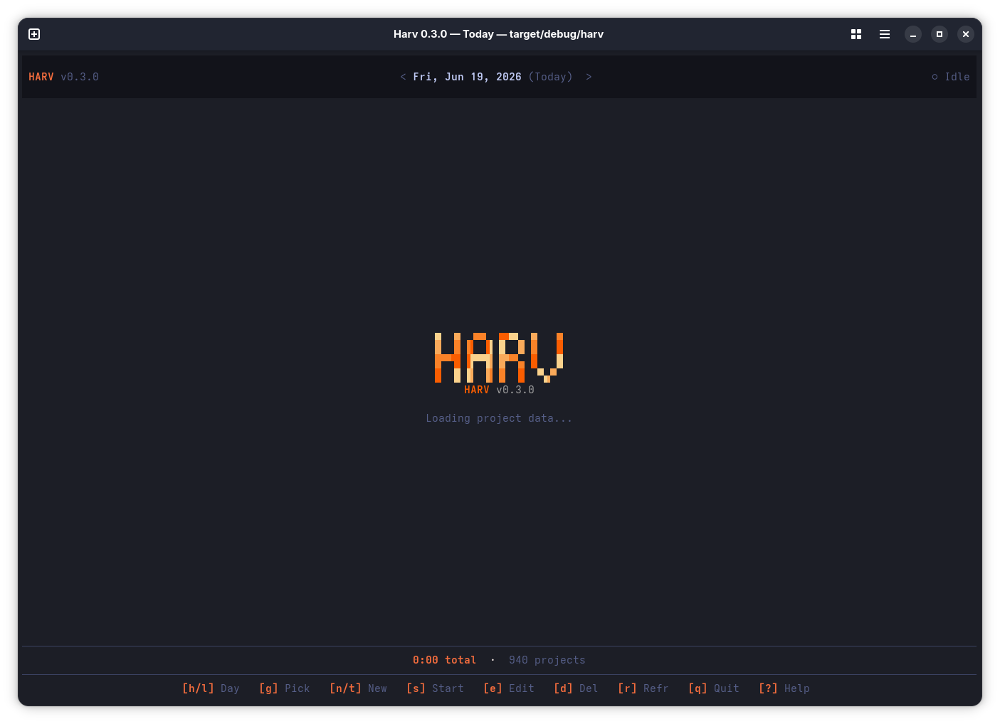

<div align="center">

[](https://github.com/josbeir/harv/actions/workflows/ci.yml)
[](https://codecov.io/gh/josbeir/harv)
[](https://opensource.org/licenses/MIT)
[](https://www.rust-lang.org)

</div>

## What is Harv?

Harv is a **command-line time-tracking client** for [Harvest](https://www.getharvest.com/). It lets you log hours, start/stop timers, and review your timesheet — all from your terminal, without touching the browser.

| | | |
|:---:|:---:|:---:|
|  |  |  |
| *Dashboard & timer* | *Time entry dialog* | *Startup* |

### Features

- **Full-screen terminal UI** — browse today's entries, start timers, and edit time with keyboard shortcuts
- **CLI wizard** — interactive prompts guide you through project selection, task, hours, date, and notes
- **Running timers** — start, stop, and edit timers in real time, with live elapsed display
- **Aliases** — create shortcuts for frequently used project/task combinations so you can type `harv start dev` instead of navigating menus
- **Project config files** — drop a `harv.toml` in your project root to set default project/task, configure note templates with git commit messages and branch names, and define project-specific aliases
- **Persistent defaults** — your last-used project and task are remembered across sessions and pre-selected for quick entry
- **Multi-language** — UI, errors, and CLI output in English, Dutch, French, German, Spanish, and Italian (auto-detected or configurable)
- **Cache** — project assignments are cached locally for instant startup; `--refresh` to force a reload
- **JSON output** — all list commands support `--output json` for scripting and piping

### Two ways to work

| Style | Command | Best for |
|-------|---------|----------|
| **TUI** | `harv` (no subcommand) | Interactive review, browsing entries, editing in-place |
| **CLI** | `harv track`, `harv start`, `harv stop`, etc. | Quick one-off entries, scripting, muscle memory |

---

## Installation

### Pre-built binaries

Download the latest binary for your platform from the [GitHub Releases](https://github.com/josbeir/harv/releases) page. Available for Linux (x86\_64, ARM64), macOS (x86\_64, ARM64), and Windows (x86\_64). Extract and place `harv` in your `$PATH`.

### From GitHub (cargo)

```bash
cargo install --git https://github.com/josbeir/harv harv-cli
```

This compiles in release mode and installs `harv` to `~/.cargo/bin/`.

### From local source

```bash
git clone https://github.com/josbeir/harv
cd harv
cargo install --path crates/harv-cli
```

### Shell completions

```bash
source <(harv completion bash)   # bash
source <(harv completion zsh)    # zsh
harv completion fish | source    # fish
```

---

## Quick Start

### 1. Connect your Harvest account

```bash
harv connect
```

Opens your browser to authenticate via OAuth2. Credentials are stored at `~/.config/harv/config.toml`.

### 2. Log your first entry

```bash
harv track
```

You'll be prompted for project, task, date, hours, and (optionally) notes. Next time you run it, your last-used project appears at the top marked with `●` — just press Enter to skip.

### 3. Explore the TUI

```bash
harv
```

Opens a full-screen dashboard. Use `s` to start a timer, `n` to create an entry, `j`/`k` to navigate, `q` to quit. See [Terminal UI](#terminal-ui) for all shortcuts.

### 4. Speed up with aliases

```bash
harv alias create dev         # interactive: pick project + task
harv start dev                # start a timer with one word
harv track -H 1.5 dev         # log 1.5 hours directly
```

### 5. Set up per-project defaults (optional)

```bash
harv init                     # interactive wizard, creates harv.toml
```

Tells Harv which project and task to pre-select when you're in this directory, lets you define note templates with git info, and more. See [Project Configuration](#project-configuration-harvtoml).

---

## Terminal UI

Running `harv` with no subcommand launches the full-screen terminal interface.

### Dashboard

The dashboard shows time entries for the selected date with a live clock for running timers, daily hours total, and quick actions. The top bar displays `HARV v0.1.0  ● Running` or `HARV v0.1.0  ○ Idle`. A date navigation bar above the table lets you browse past days.

| Key | Action |
|-----|--------|
| `s` | Start a timer (confirms if one is already running) |
| `n` / `t` | New time entry with hours/notes |
| `e` / `Enter` | Edit selected entry |
| `d` | Delete entry (with confirmation) |
| `x` | Stop running timer |
| `j` / `k` or `↓` / `↑` | Navigate entries |
| `h` / `←` | Previous day |
| `l` / `→` | Next day |
| `T` | Go to today |
| `g` | Open date picker |
| `r` | Refresh data |
| `?` | Keyboard shortcuts overlay |
| `q` / `Ctrl+C` | Quit |

### Time Entry Dialogs

Pressing `s`, `n`, `t`, or `e` opens a form dialog:

- **Project** — fuzzy-search list, type to filter
- **Task** — filtered by selected project, type to filter
- **Date** — defaults to today (hidden for running timers)
- **Hours** — decimal (`1.5`) or HH:MM (`1:30`); leave empty to start a timer
- **Notes** — optional

`Tab` / `Shift+Tab` moves between fields. `j` / `k` navigates lists. `Enter` submits. `Esc` cancels. Press `g` on the Date field to open a visual date picker.

### Theme

Auto-detects dark/light mode from your OS. Real-time switching via D-Bus on Linux, polling on macOS/Windows.

---

## Configuration

### Global config (`~/.config/harv/config.toml`)

View with `harv config`, modify with `harv config set`.

| Setting | Default | Description |
|---------|---------|-------------|
| `cache-ttl` | `24` | Cache lifetime in hours (0 = always fetch) |
| `locale` | *(auto-detect)* | Display language: `en`, `nl`, `fr`, `de`, `es`, `it` |

#### Localization

`harv` auto-detects your system language via `LANG`. To override:

```bash
harv config set locale nl
```

Affects all CLI output, error messages, and TUI labels. Falls back to English if a translation is missing.

#### Custom OAuth2 Application

To use your own Harvest OAuth2 application (registered at [id.getharvest.com/developers](https://id.getharvest.com/developers)), set `HARV_CLIENT_ID` at compile time:

```bash
HARV_CLIENT_ID="your-app-id" cargo install --git https://github.com/josbeir/harv harv-cli
```

Set your redirect URI to `http://localhost:5006`.

### Project config (`harv.toml`)

Placed in a project directory and discovered by walking up from your current location (like `.git`). All fields optional.

#### Quick setup

```bash
harv init                         # interactive wizard
harv init -p 123 -t 456           # non-interactive
harv init --force                 # overwrite existing file
```

#### Example

```toml
default_project_id = 12345
default_task_id = 67890

[aliases.dev]
project_id = 100
task_id = 200

[templates.daily]
pattern = "Daily standup — {date} — Branch: {branch_name}"
```

#### Fields

| Field | Description |
|-------|-------------|
| `default_project_id` | Pre-select this project when creating entries |
| `default_task_id` | Pre-select this task when creating entries |
| `[aliases.<name>]` | Project-specific aliases (merge with global; project wins on conflict) |
| `[templates.<name>]` | Named note templates with `{variable}` substitution |

#### Template Variables

If a template named `"default"` exists, notes are pre-filled with expanded variables:

| Variable | Source | Example |
|----------|--------|---------|
| `{date}` | Today's date | `2026-06-13` |
| `{time}` | Current time | `14:30` |
| `{hostname}` | System hostname | `my-laptop` |
| `{commit_message}` | Latest git commit subject | `feat: add login page` |
| `{branch_name}` | Current git branch | `feat-login` |
| `{project_name}` | Harvest project name | `Website Redesign` |
| `{task_name}` | Harvest task name | `Frontend` |
| `{user_name}` | Your Harvest name | `Jane Doe` |

> Git variables resolve to empty strings when outside a repository.

---

## Commands

| Command | Description |
|---------|-------------|
| `harv` | Open the full-screen terminal UI |
| `harv connect` | Authenticate with Harvest via OAuth2 |
| `harv disconnect` | Remove stored credentials |
| `harv track` | Interactive time-entry wizard (`harv log` also works) |
| `harv start` | Start a running timer |
| `harv stop` | Stop the running timer |
| `harv note` | Edit notes on the running timer |
| `harv edit [id]` | Edit a time entry (pick interactively if no ID) |
| `harv status` | Show current timer + today's entries |
| `harv whoami` | Show authenticated user info |
| `harv projects` | List your project assignments |
| `harv tasks <project-id>` | List tasks for a project |
| `harv config [get\|set]` | View or modify global settings |
| `harv alias [create\|list\|delete]` | Manage project/task aliases |
| `harv init` | Create a `harv.toml` project config |
| `harv completion <shell>` | Generate shell completion script |

### Flags

| Flag | Applies to | Description |
|------|-----------|-------------|
| `-p, --project-id <id>` | `track`, `start`, `edit`, `init` | Skip project prompt |
| `-t, --task-id <id>` | `track`, `start`, `edit`, `init` | Skip task prompt |
| `-H, --hours <h>` | `track`, `edit` | Hours (decimal `2.5` or HH:MM `2:30`) |
| `-d, --date <date>` | `track`, `start`, `edit` | Override date (YYYY-MM-DD) |
| `-n, --notes <text>` | `track`, `start`, `stop`, `note`, `edit` | Set notes inline |
| `-e, --editor` | `track`, `start`, `stop`, `note`, `edit` | Open `$EDITOR` for notes |
| `--overwrite` | `stop`, `note`, `edit` | Replace notes instead of appending |
| `--template <name=pattern>` | `init` | Add a note template (repeatable) |
| `--alias <name=pid:tid>` | `init` | Add a project alias (repeatable) |
| `-f, --force` | `init` | Overwrite existing harv.toml |
| `-R, --refresh` | `track`, `start`, `edit`, `projects` | Bypass cache |
| `-s, --search <query>` | `projects` | Filter projects by name |
| `-o, --output <table\|json>` | All list commands | Output format |

---

## Development

- **Prerequisites**: Rust 1.85+
- **Build**: `cargo build --workspace`
- **Test**: `cargo test --workspace`
- **Lint**: `cargo clippy --all-targets -- -D warnings && cargo fmt --all -- --check`
- **Coverage**: `cargo tarpaulin --workspace`

### Architecture

```
harv-core (domain types, errors, i18n)
  ↓
harv-sdk  (Harvest API v2 client, auth, cache, pagination, config)
  ↓  ↙
harv-cli  (CLI binary + TUI launcher)
harv-tui  (terminal UI library)
```

### Mock Mode

Run the full TUI and CLI against a local mock server with realistic data — no Harvest account needed.

```bash
# Enable mock mode (requires the mock-mode feature)
HARV_MOCK=1 cargo run --features mock-mode

# CLI wizard with mock data
HARV_MOCK=1 cargo run --features mock-mode -- track

# Simulate network latency (default: 0ms)
HARV_MOCK_DELAY_MS=200 HARV_MOCK=1 cargo run --features mock-mode
```

The mock server provides 7 projects, 4 clients, 8 tasks, and sample time entries so you can explore every feature without hitting the real API.

---

## Disclaimer

This project is **not affiliated, associated, authorized, endorsed by, or in any way officially connected** with [Harvest](https://www.getharvest.com/) or its parent company. "Harvest" is a registered trademark of Iridesco, LLC. This is an independent, community-built CLI client for the Harvest public API.

## License

MIT
