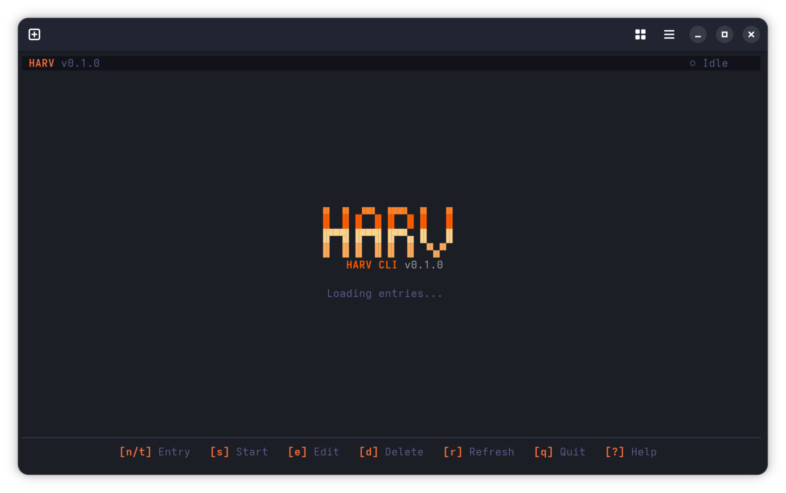

<p align="center">
  
</p>

<p align="center">

`harv` — Because remembering to punch the clock is harder than writing the code. A Rust CLI for [Harvest](https://www.getharvest.com/) that respects your terminal, your config, and your deadline.

</p>

<div align="center">

[](https://github.com/josbeir/harv/actions/workflows/ci.yml)
[](https://codecov.io/gh/josbeir/harv)
[](https://opensource.org/licenses/MIT)
[](https://www.rust-lang.org)

</div>

## Installation

### Pre-built binaries

Download the latest binary for your platform from the [GitHub Releases](https://github.com/josbeir/harv/releases) page. Available for Linux (x86\_64, ARM64), macOS (x86\_64, ARM64), and Windows (x86\_64). Extract and place `harv` in your `$PATH`.

### From GitHub (cargo)

```bash
cargo install --git https://github.com/josbeir/harv harv-cli
```

This compiles in release mode and installs `harv` to `~/.cargo/bin/` (which must be in your `$PATH`).

### From local source

```bash
git clone https://github.com/josbeir/harv
cd harv
cargo install --path crates/harv-cli
```

### Shell completions

Add to `~/.bashrc` (or the equivalent for your shell):

```bash
source <(harv completion bash)
```

Other shells: replace `bash` with `zsh`, `fish`, `elvish`, or `powershell`.

## Quick Start

### 1. Authenticate

```bash
harv connect
```

Opens your browser to authenticate with Harvest via OAuth2. Credentials are stored at `~/.config/harv/config.toml`.

### 2. Track time

```bash
harv         # Full-screen terminal UI (default when no subcommand)
harv track   # CLI wizard
```

The terminal UI opens a dashboard showing today's entries with keyboard shortcuts. `s` starts a timer, `n` creates a new entry, `e` edits an existing one. See [Terminal UI](#terminal-ui) below.

The CLI wizard (`harv track`) prompts for:

- **Project** — fuzzy search, pick with arrow keys
- **Task** — filtered to the selected project
- **Date** — defaults to today
- **Hours** — decimal (`1.5`) or HH:MM (`1:30`); enter 0 or leave empty to start a running timer
- **Notes** — optional

Once you track time, your last-used project and task are remembered — next time you run `harv track`, that project appears at the top with a `●` for a quick Enter skip.

### 3. Quick commands

```bash
harv start [alias]       # Start a running timer
harv stop                # Stop the running timer
harv track -H 1.5 [alias] # Track 1.5 hours (harv log is an alias)
harv note                # Edit running timer notes
harv edit                # Edit an existing time entry
harv edit 12345678        # Edit entry by ID
harv status              # Show current timer + today's entries
harv whoami              # Show authenticated user info
harv disconnect          # Remove stored credentials
```

### 4. Aliases

Create shortcuts for frequently used project/task pairs:

```bash
harv alias create dev    # Interactive: pick project + task
harv alias list
harv alias delete dev
```

Use aliases to skip prompts:

```bash
harv start dev
harv track -H 1.5 dev
```

### 5. Project configuration (optional)

```bash
harv init    # Interactive wizard to create harv.toml in the current directory
```

Set default project/task, note templates with git info, and project-specific aliases per directory. See [Project Configuration (harv.toml)](#project-configuration-harvtoml) below.

## Terminal UI

Running `harv` with no subcommand launches the full-screen terminal interface.



### Dashboard

Shows time entries for the selected date with a live clock for running timers, daily hours total, and quick actions. Top bar shows `HARV v0.1.0  ● Running` or `HARV v0.1.0  ○ Idle` depending on timer state. A date navigation bar above the table lets you browse past days.

| Key | Action |
|-----|--------|
| `s` | Start a timer (confirms if one is already running) |
| `n` / `t` | New time entry with hours/notes |
| `e` / `Enter` | Edit selected entry |
| `d` | Delete entry (with confirmation) |
| `x` | Stop running timer |
| `j` / `k` or `↓` / `↑` | Navigate entries |
| `h` / `←` | Previous day |
| `l` / `→` | Next day |
| `T` | Go to today |
| `g` | Open date picker |
| `r` | Refresh data |
| `q` / `Ctrl+C` | Quit |

### Time Entry Dialogs

Pressing `s`, `n`, `t`, or `e` opens a form dialog with:

- **Project** — fuzzy-search list, type to filter
- **Task** — filtered by selected project, type to filter
- **Date** — defaults to today (create/edit stopped entries only; hidden for running timers)
- **Hours** — decimal (`1.5`) or HH:MM (`1:30`), empty = start running timer (hidden for running timers)
- **Notes** — optional

`Tab` / `Shift+Tab` moves between fields. `j` / `k` navigates within list fields. `Enter` submits. `Esc` cancels. Press `g` on the Date field to open a visual date picker.

When editing a running timer, only Project, Task, and Notes are shown — Date and Hours cannot be changed while a timer is accumulating time.

Last-used project and task IDs are persisted so the form pre-selects them on subsequent opens.

### Theme

Auto-detects dark/light mode from your OS. Real-time switching via D-Bus on Linux, polling on macOS/Windows.

| Key | Action |
|-----|--------|
| `?` | Keyboard shortcuts overlay |

## Commands

| Command | Description |
|---------|-------------|
| `harv connect` | Authenticate with Harvest via OAuth2 |
| `harv disconnect` | Remove stored credentials |
| `harv config` | Show full configuration |
| `harv config get <key>` | Get a config value (e.g. `cache-ttl`) |
| `harv config set <key> <val>` | Set a config value (e.g. `cache-ttl 48`) |
| `harv track [alias]` | Track time (interactive wizard if no args; `harv log` is an alias) |
| `harv start [alias]` | Start a running timer |
| `harv stop` | Stop the current running timer |
| `harv note` | Edit notes on the running timer |
| `harv edit [entry-id]` | Edit an existing time entry (interactive picker if no ID) |
| `harv status` | Show current timer + today's entries |
| `harv whoami` | Show authenticated user info and login status |
| `harv projects` | List project assignments |
| `harv tasks <project-id>` | List tasks for a project |
| `harv alias create <name>` | Create a project/task alias |
| `harv alias list` | List all aliases |
| `harv alias delete <name>` | Delete an alias |
| `harv init` | Create project config (harv.toml) interactively |
| `harv completion <shell>` | Generate shell completion script |

### Command Flags

Most time-tracking commands (`track`, `start`) share common flags:

| Flag | Description |
|------|-------------|
| `-p, --project-id <id>` | Skip project prompt |
| `-t, --task-id <id>` | Skip task prompt |
| `-H, --hours <hours>` | Hours in decimal (`2.5`) or HH:MM (`2:30`) — `track` only |
| `-d, --date <date>` | Override date (default: today) |
| `-n, --notes <text>` | Set notes inline |
| `-e, --editor` | Open `$EDITOR` for notes |
| `-R, --refresh` | Force-refresh cached project data |

`harv stop` and `harv note` use a subset:

| Flag | Description |
|------|-------------|
| `-n, --notes <text>` | Set notes inline |
| `-e, --editor` | Open `$EDITOR` for notes |
| `--overwrite` | Replace existing notes instead of appending |

`harv edit`:

| Flag | Description |
|------|-------------|
| `-p, --project-id <id>` | New project |
| `-t, --task-id <id>` | New task |
| `-H, --hours <hours>` | New hours (stopped entries only) |
| `-d, --date <date>` | New date (stopped entries only) |
| `-n, --notes <text>` | Add or update notes |
| `-e, --editor` | Open `$EDITOR` for notes |
| `--overwrite` | Replace notes instead of appending |
| `-R, --refresh` | Force-refresh cached project data |

`harv projects`:

| Flag | Description |
|------|-------------|
| `-s, --search <query>` | Filter projects by name |
| `-R, --refresh` | Force-refresh cached data |

`harv init`:

| Flag | Description |
|------|-------------|
| `-p, --project-id <id>` | Default project ID |
| `-t, --task-id <id>` | Default task ID |
| `--template <name=pattern>` | Add a note template (repeatable) |
| `--alias <name=pid:tid>` | Add a project alias (repeatable) |
| `-f, --force` | Overwrite existing harv.toml |

## Global Options

| Flag | Description |
|------|-------------|
| `-o, --output <table\|json>` | Output format for list commands (default: `table`) |

## Configuration

Config is stored at `~/.config/harv/config.toml`. View with `harv config`, modify with `harv config set`.

| Setting | Default | Description |
|---------|---------|-------------|
| `cache-ttl` | `24` | Cache lifetime in hours (0 = always fetch) |
| `locale` | *(auto-detect)* | Display language. Supported: `en`, `nl`, `fr`, `de`, `es`, `it` |

Project assignments are cached with the configured TTL. Subsequent `track`/`start` commands return instantly. Use `--refresh` to bypass the cache.

### Localization

`harv` auto-detects your system language via the `LANG` environment variable or OS locale. To override, set `locale` in your config:

```bash
harv config set locale nl
```

This affects all CLI output, error messages, and TUI labels. If a translation is missing for your locale, it falls back to English. Supported: English, Dutch, French, German, Spanish, Italian.

## Project Configuration (harv.toml)

Project-specific settings are stored in a `harv.toml` file, discovered by walking up from the current directory (like `.git`). All fields are optional — an empty `harv.toml` is valid.

### Quick setup

```bash
harv init                    # Interactive wizard
harv init --force             # Overwrite existing harv.toml
harv init -p 123 -t 456       # Non-interactive (CLI flags only)
```

### Example

```toml
default_project_id = 12345
default_task_id = 67890

[aliases.dev]
project_id = 100
task_id = 200

[templates.daily]
pattern = "Daily standup — {date} — Branch: {branch_name}"
```

### Fields

| Field | Type | Description |
|-------|------|-------------|
| `default_project_id` | u64 | Pre-select this project when creating entries |
| `default_task_id` | u64 | Pre-select this task when creating entries |
| `[aliases.<name>]` | table | Project-specific aliases (merge with global ones; project wins on name conflict) |
| `[templates.<name>]` | table | Named note templates with `{variable}` substitution |

### Template Variables

When creating a time entry and a template named `"default"` exists, notes are pre-filled with expanded variables:

| Variable | Source | Example |
|----------|--------|--------|
| `{date}` | Today's date | `2026-06-13` |
| `{time}` | Current time | `14:30` |
| `{hostname}` | System hostname | `my-laptop` |
| `{commit_message}` | Latest git commit subject | `feat: add harv.toml support` |
| `{branch_name}` | Current git branch | `feat-project-configs` |
| `{project_name}` | Harvest project name | `Website Redesign` |
| `{task_name}` | Harvest task name | `Frontend Development` |
| `{user_name}` | Harvest user name | `Jane Doe` |

> Git variables (`{commit_message}`, `{branch_name}`) resolve to empty strings if not in a repository. All variables gracefully degrade.

### Multiple Templates

You can define multiple named templates. The one named `"default"` is auto-used when creating entries:

```toml
[templates.default]
pattern = "Daily — {date} — {branch_name}"

[templates.meeting]
pattern = "Meeting: {project_name} — {date}"
```

To use a non-default template, reference it via CLI flags (support planned for `--template <name>` in a future release).

### Discovery

`harv.toml` is located by walking up from the current working directory to the filesystem root, stopping at the first file found. This matches the behavior of `.git`, `.eslintrc`, and similar tooling — you can place one `harv.toml` at your project root and use it from any subdirectory.

### Alias Merging

Project aliases merge with global aliases from `~/.config/harv/config.toml`. When the same alias name exists in both places, the project-specific definition takes priority:

```bash
harv alias list
# Alias    Project    Task    Source
# dev      My App     Coding  project
# global   Other App  Admin   global
```

### Custom OAuth2 Application

By default `harv` ships with a built-in Harvest OAuth2 client ID. To use your own application (registered at [id.getharvest.com/developers](https://id.getharvest.com/developers)), set the `HARV_CLIENT_ID` environment variable at compile time:

```bash
HARV_CLIENT_ID="your-app-id" cargo install --git https://github.com/josbeir/harv harv-cli
```

When registering your app, set the redirect URI to `http://localhost:5006`.

## Development

### Prerequisites

- Rust 1.85+

### Build

```bash
cargo build --workspace
```

### Test

```bash
cargo test --workspace
```

### Lint

```bash
cargo clippy --all-targets -- -D warnings
cargo fmt --all -- --check
```

### Coverage

```bash
cargo tarpaulin --workspace
```

## Architecture

```
harv-core (domain types, errors)
  ↓
harv-sdk  (Harvest API v2 client)
  ↓  ↙
harv-cli  (CLI binary + TUI launcher)
harv-tui  (terminal UI library)
```

## Disclaimer

This project is **not affiliated, associated, authorized, endorsed by, or in any way officially connected** with [Harvest](https://www.getharvest.com/) or its parent company. "Harvest" is a registered trademark of Iridesco, LLC. This is an independent, community-built CLI client for the Harvest public API.

## License

MIT
